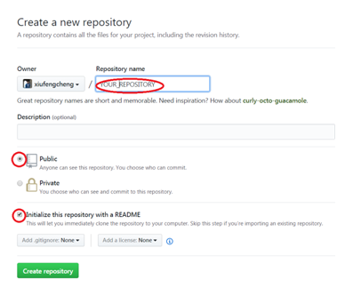
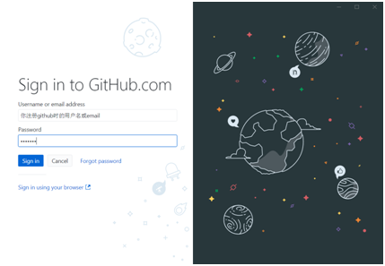
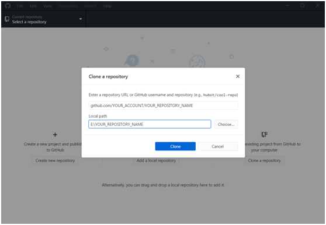
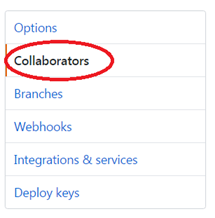

# 如何使用Github
## 注册Github账号  
* 建议各位使用QQ邮箱进行注册  
* 注册号以后登录，会发现一个带有火箭的页面，它表   示着你的GitHub之旅即将启程  

## 在网页上新建一个仓库(Repository)  
* 点击右上角的加号添加一个仓库（Repository）    
   

* 新建一个仓库    
   

* 你可以发现你多了一个仓库  
  

* 以后登录网站，进入自己的主页面，需要点击右上角   的图像，选择Your Profile 就可以看到自己建的所有仓库了。  
  

# 如何使用Git工具  
 GitHub有两种工具，一种是**gitbush**，他是命令行工具，可以用它来做更加细致的工作。另一种是相对简单的图形界面操作工具**GitHub Desktop**，这两种工具的作用都是一样的，只是操作方法后者更为简单易用。在这里我们只介绍GitHub Desktop。

## 下载并登陆GitHub Desktop
* 安装完成后，你会看到桌面上的快捷方式  
  

* 第一次打开它时，输入你的GitHub的账号和密码  
  

## 克隆仓库  
* 进去以后，主页面中选择File->Clone Repository，将你的远程仓库克隆到你的本地，同样的，你也可以克隆任何人的任何仓库到你的本地。  
  

* 这样，你就可以在本地上克隆下来的那个仓库了。   
## 推送到远程仓库（Push）
* 然后，你势必会在本地仓库中添加一些代码，如何push到远程仓库呢？
* 首先，你可以push的远程仓库有两类，一类是自己的仓库，一类是别人的仓库(这些仓库加了你为collaborator) 。
* 这里又引申出一个问题，如何往自己的某个仓库中添加collaborators呢？在这里：
  
  

* 好，现在回到如何push问题上，很简单，本地代码有任何的变动，GitHub Desktop是会有察觉的。 

* 其中红色带减号的部分表示删除的内容，加号部分表示增加的内容  
* 在左下角的summary中填上你更改的说明情况，然后点击左下角的Commit按钮  

* 然后再点击右上角的Push按钮  
  

* 搞定！！！是不是很简单？

## 更新本地仓库（Fetch）
* 如果你的collaborator更改了项目，那么只需要点击Fetch按钮(和push按钮的位置一样)，就可以更新本地仓库了！

# 如何向原创者发起pull request  
* git是一个很强大的工具，其中重要的一点就是可向任何人发起Pull Request
* 首先，你必须fork别人的某个仓库，这样，你的仓库中也有了一个和别人一模一样的仓库。
* 点击左上角的猫  

* 在接下来出现的控制台页面中，会看到哪些是你自己建的仓库，哪些是你fork别人的仓库。  
  

* 查查看，你的仓库中是不是有了fork过来的别人的仓库?
* 然后，把想编辑的仓库克隆到你的本地
* 增加完代码后，commit并push提交到**你自己的远程仓库中**
* 然后，到网站上去，找到自己的那个fork过来的仓库，点击New Pull Request  

* 填写该填写的东西，提交给原创作者。接下来的事就交给原创作者自己定夺了...、
* 有关git工作流的详细论述请点击  
[**Git 工作流**](https://github.com/xirong/my-git/blob/master/git-workflow-tutorial.md)  

# 如何使用VSCode

# 如何使用Graphivz
